# UE5-sonic-boilerplate
Procedural sound systems in UE5 | boilerplate blueprints and research.

---
This repository exemplifies basic concepts for developing sound and music systems with MetaSounds and it is meant to serve as a spring board for further experimentation. The assets featured here build upon content available in the Epic Unreal Engine learning community, namely Matt Spendlove's introductory tutorial series and accompanying repository.

- [Intro to MetaSounds tutorial series by Matt Spendlove](https://dev.epicgames.com/community/learning/tutorials/Kw7l/unreal-engine-metasounds)
- [Intro to MetaSounds GitHub repo](https://github.com/msp/6070-intro-to-metasounds)
# Repo structure:

> **sonicBoilerplate** | This is the UE5 project folder containing the game environments and all the MetaSound blueprints, sources, and patches exemplified.
> 
>>**Content** | This is the main content folder present in all UE projects.
>>
>>> **01_HelloWorld** | All example node graphs (sources and patches) are contained in numbered folders like this one with sub-folders for each asset type.
>>> 
>>> > **MetaSounds** | This folder contains the MetaSounds *Sources* for each example.
>>> > 
>>> > **Patches** | This Folder contains the MetaSounds *Patches* for each example (used within the sources).
>>> > 
>>> > **Blueprints** | This folder contains the Blueprints for each example (which make use of the MetaSound Sources).
>>> > 
>>> ...

All node graph examples are explained in more detail in the section that follows.
# MetaSounds examples:

## 01_HelloWorld

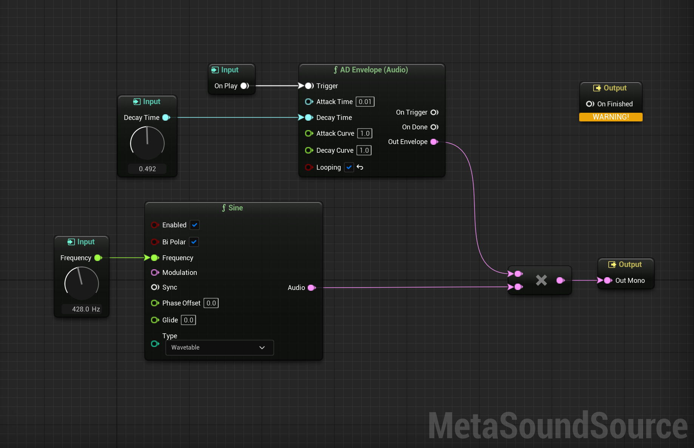
## 02_SampleBased-WavePlayer

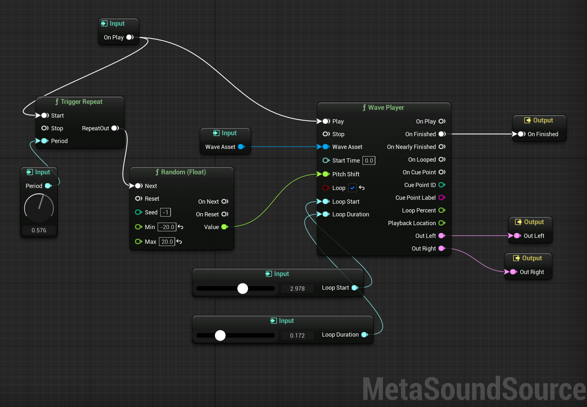
## 03_SampleBased-SampleVariation

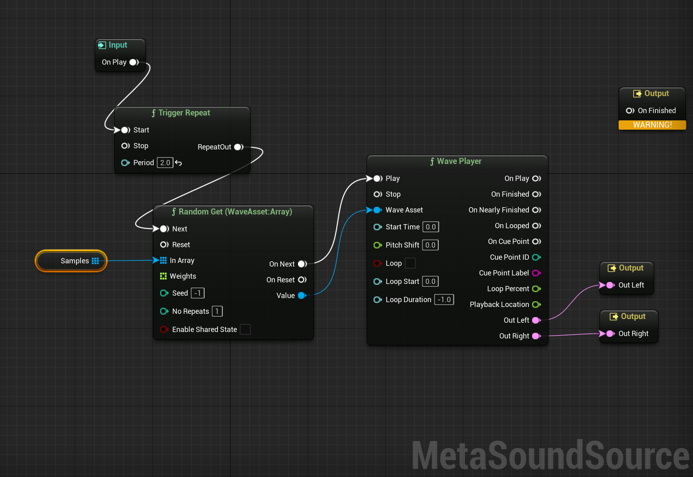

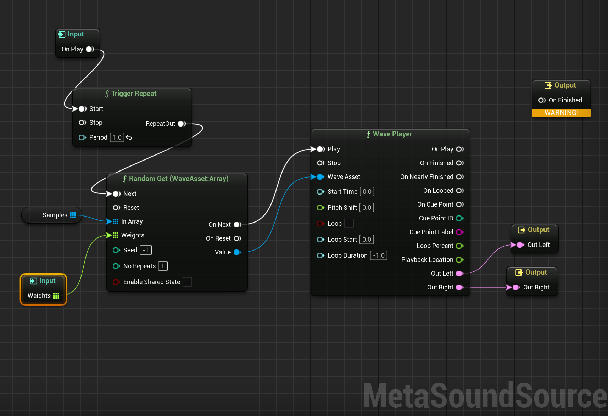
## 04_Sythesis

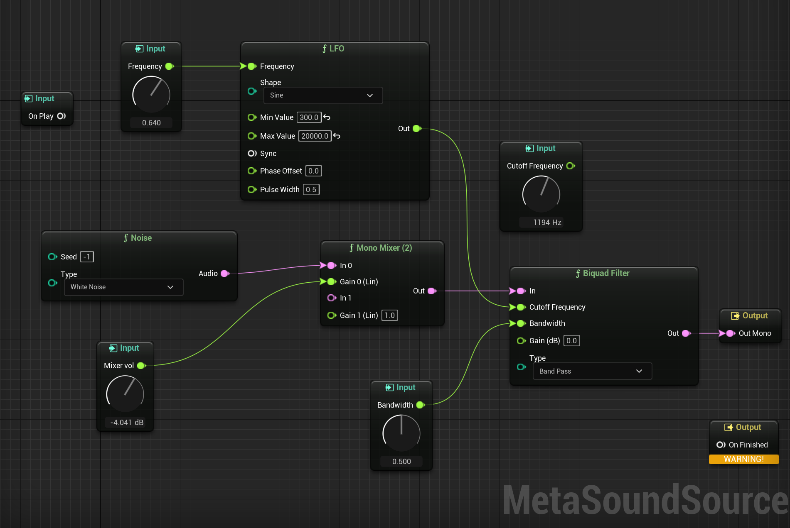

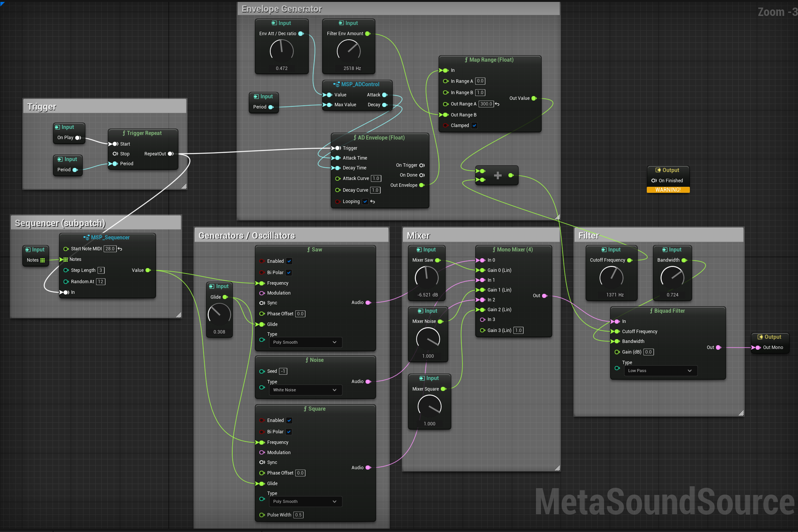
## 08_SampleBased-Tempo

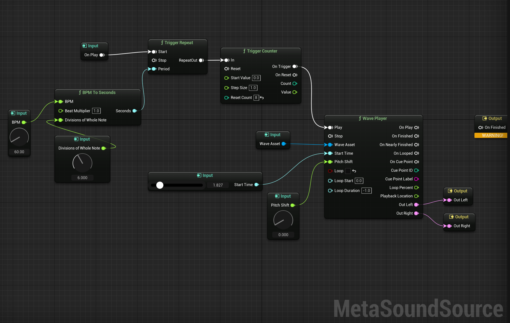

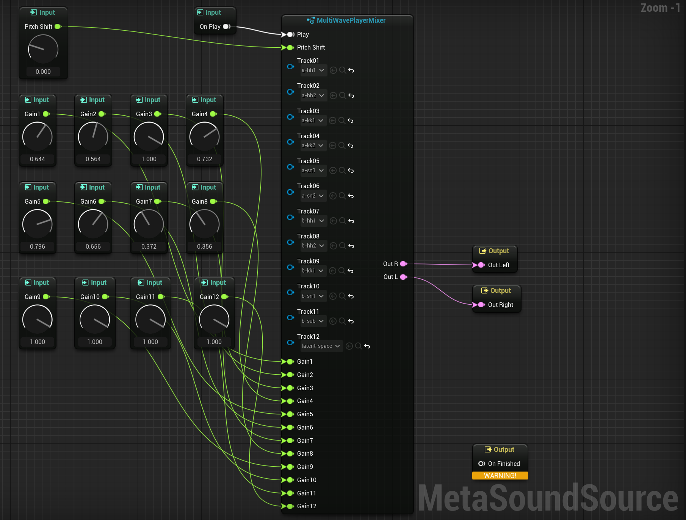

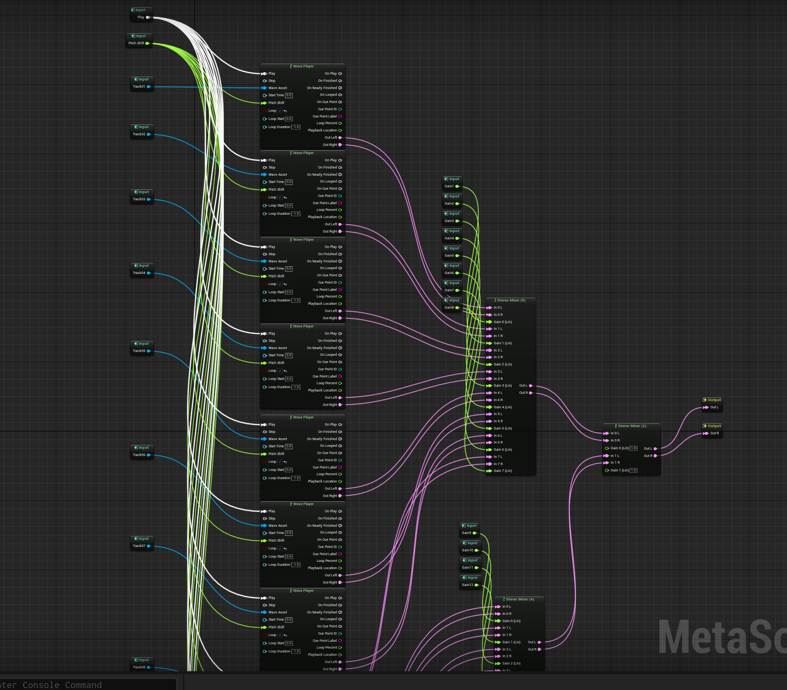

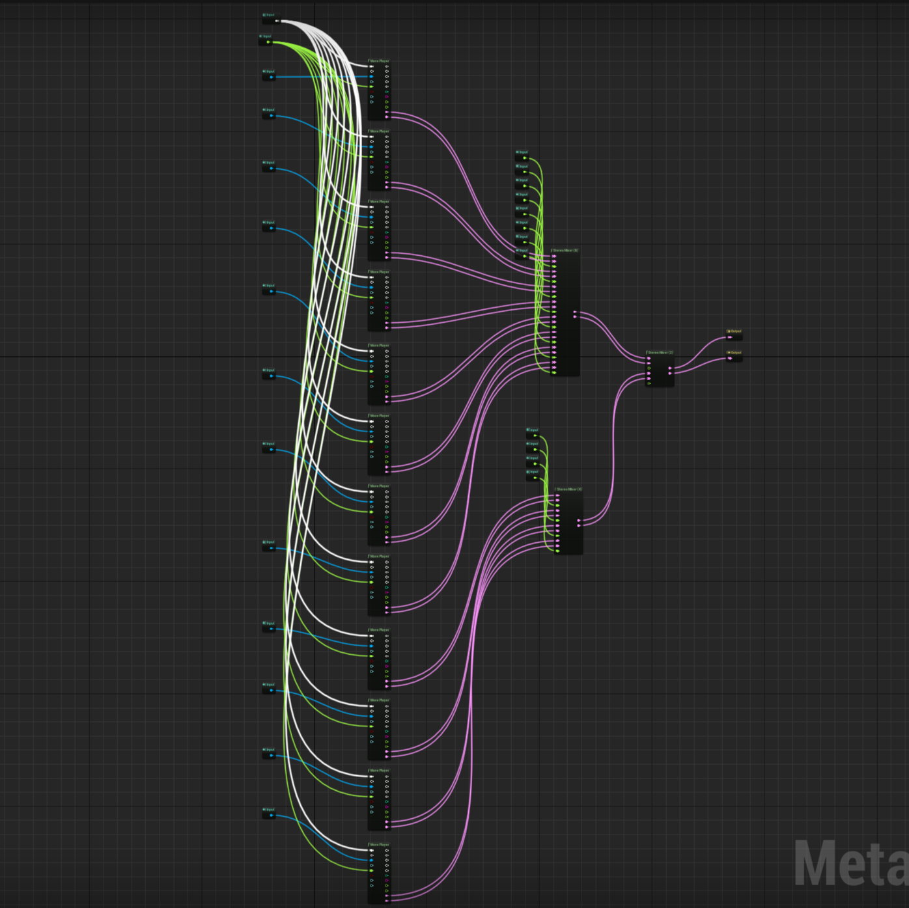

## EightTrackPlayer_BP

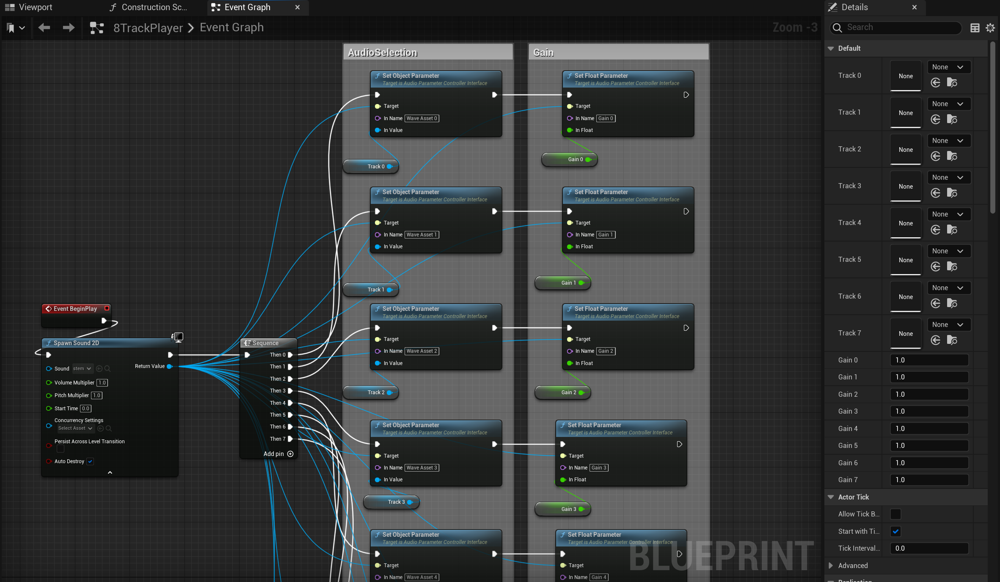

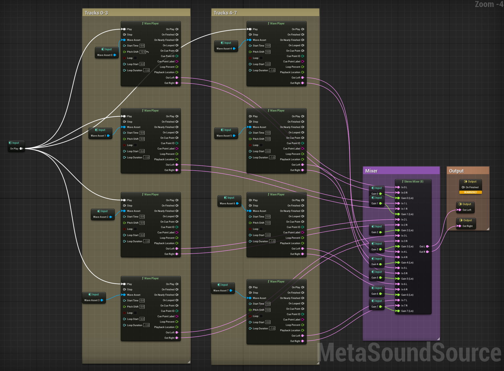
